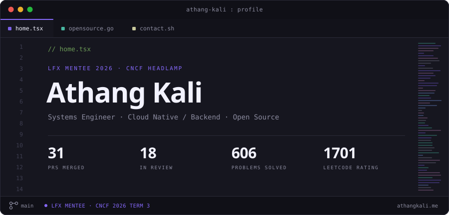

<p align="center">
  <a href="https://www.athangkali.me">
    <picture>
      <source media="(prefers-color-scheme: dark)" srcset="./assets/hero-dark.svg">
      <source media="(prefers-color-scheme: light)" srcset="./assets/hero-light.svg">
      
    </picture>
  </a>
</p>

I work on systems software, mostly in **Go** and **C++**, close to the metal: kernel-level programming, container orchestration internals and distributed agents. Most of that work happens in the open, across CNCF projects. Final year B.Tech, and I spend most of it writing code that ships.

**Open to software engineering roles in Systems, Cloud Native and Backend.**

<br>

### Right now

Selected as an **[LFX Mentee with CNCF][lfx]** for 2026 Term 3, building the visual and operational layer of the **[Headlamp Kyverno plugin][plugins]**, the interface operators use to manage Kyverno policies from inside the CNCF Kubernetes dashboard.

Policy Impact Map · violation drill-down · Prometheus integration · CEL-based policy views · i18n and accessibility

<br>

### Open source

**31 pull requests merged** into CNCF projects, with 17 more in review.

| Project | | Merged | In review |
| :-- | :-- | --: | --: |
| **[kubernetes-sigs/headlamp][hl]** | CNCF Kubernetes dashboard | **[21][hl-m]** | 4 |
| **[kubearmor/KubeArmor][ka]** | CNCF runtime security | **[10][ka-m]** | 9 |
| **[headlamp-k8s/plugins][plugins]** | Headlamp plugin catalogue | 0 | 4 |

<details>
<summary><b>Selected contributions</b></summary>

<br>

**Headlamp**, across the React frontend, the Helm layer and the Go backend. Crashes, routing, release integrity and test coverage.

- Fixed a CronJob detail-view crash, and a portforward handler that exposed `userID` suffixes in responses.
- Fixed a test that overwrote the real user kubeconfig.
- Broke a circular frontend import by moving cluster hooks to `api/v1/hooks`, unblocking static analysis.
- Added authenticated Helm repository support, enabling private registry workflows.
- Hardened `isValidRedirectPath` against whitespace and URL-encoded protocol bypass.
- Added cosign keyless signing for release checksums.
- Raised `pkg/config` test coverage from 74.2% to 83.9%.

**KubeArmor**, on correctness in the enforcement and container lifecycle paths, plus supply-chain hardening.

- Raised the OpenSSF Scorecard from **0/10 to 6/10** by introducing Renovate and pinning every dependency.
- Fixed containerd exit-event handling by unmarshalling through the `TaskExit` type.
- Updated Go dependencies to clear known security vulnerabilities.
- Added unit tests for the main package and stabilised intermittent `blockposture` CI failures.
- Added openEuler 24.03 LTS-SP3 to the supported platform matrix.

</details>

<br>

### Selected work

**[Distributed Linux Fleet Management][p1]** · `C++` `Drogon` `systemd` `Prometheus`
> Host-monitoring platform with a lightweight agent streaming live `/proc` and `/sys` metrics. Zero-touch systemd onboarding registers a new node from one generated shell command, and remote execution is secured with HMAC-SHA256 request signing and constant-time verification.

**[File Encrypter / Decrypter][p2]** · `C++` `POSIX` `RAII`
> Recursive directory encryption driven by a producer-consumer task queue, parallelised with POSIX `fork()`. RAII smart pointers move file-stream ownership across the IO, Task and ProcessManagement layers.

**[URL Shortener API][p3]** · `Go` `Fiber` `Redis` `Docker`
> Sub-10ms redirects via Redis O(1) lookups with TTL expiry. Per-IP rate limiting runs on a dedicated Redis database, logically isolated from link storage, so abuse never touches redirect throughput.

**[Expense Tracker][p4]** · `React` `Node` `MongoDB` `Chart.js`
> Full-stack expense manager with Chart.js breakdowns, JWT auth and bcrypt-hashed passwords. Reworked MongoDB queries cut read latency by ~15%. *([live][p4-live])*

<br>

### Stack

```
Languages      Go · C++ · TypeScript · JavaScript · SQL · Shell · Python
Cloud native   Kubernetes · eBPF · Kyverno · KubeArmor · CEL · Docker · Helm
Supply chain   SLSA · OpenSSF Scorecard · cosign · Renovate · GitHub Actions
Backend        Node.js · Express · Fiber · Drogon · REST · WebSocket
Data           PostgreSQL · MongoDB · MySQL · Redis · Prisma
Observability  Prometheus · Grafana · Node Exporter
```

<br>

### Elsewhere

**[athangkali.me][site]** · [LinkedIn][li] · [X][x] · [LeetCode][lc] · [athangkali21@gmail.com][mail]

<sub>Banner stats are generated from the GitHub and LeetCode APIs and refresh daily, see <a href="scripts/gen_hero.py"><code>scripts/gen_hero.py</code></a>.</sub>

[lfx]: https://mentorship.lfx.linuxfoundation.org/project/db537dd6-3ea7-49d0-9a53-f0b4ad772add
[hl]: https://github.com/kubernetes-sigs/headlamp
[hl-m]: https://github.com/kubernetes-sigs/headlamp/pulls?q=is%3Apr+author%3AAthang69+is%3Amerged
[ka]: https://github.com/kubearmor/KubeArmor
[ka-m]: https://github.com/kubearmor/KubeArmor/pulls?q=is%3Apr+author%3AAthang69+is%3Amerged
[plugins]: https://github.com/headlamp-k8s/plugins
[p1]: https://github.com/Athang69/Distributed-Linux-Fleet-Management
[p2]: https://github.com/Athang69/file_encrypter_decrypter
[p3]: https://github.com/Athang69/shorten-url-fiber-redis
[p4]: https://github.com/Athang69/Expense-Tracker
[p4-live]: https://expense-tracker-lemon-eta-39.vercel.app/
[site]: https://www.athangkali.me
[li]: https://www.linkedin.com/in/athang-kali-56341426a/
[x]: https://x.com/AthangKali
[lc]: https://leetcode.com/u/AthangOP/
[mail]: mailto:athangkali21@gmail.com
